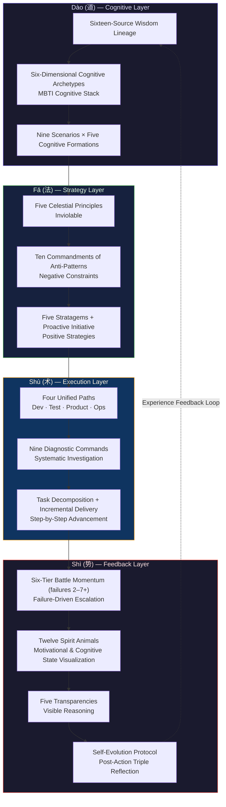
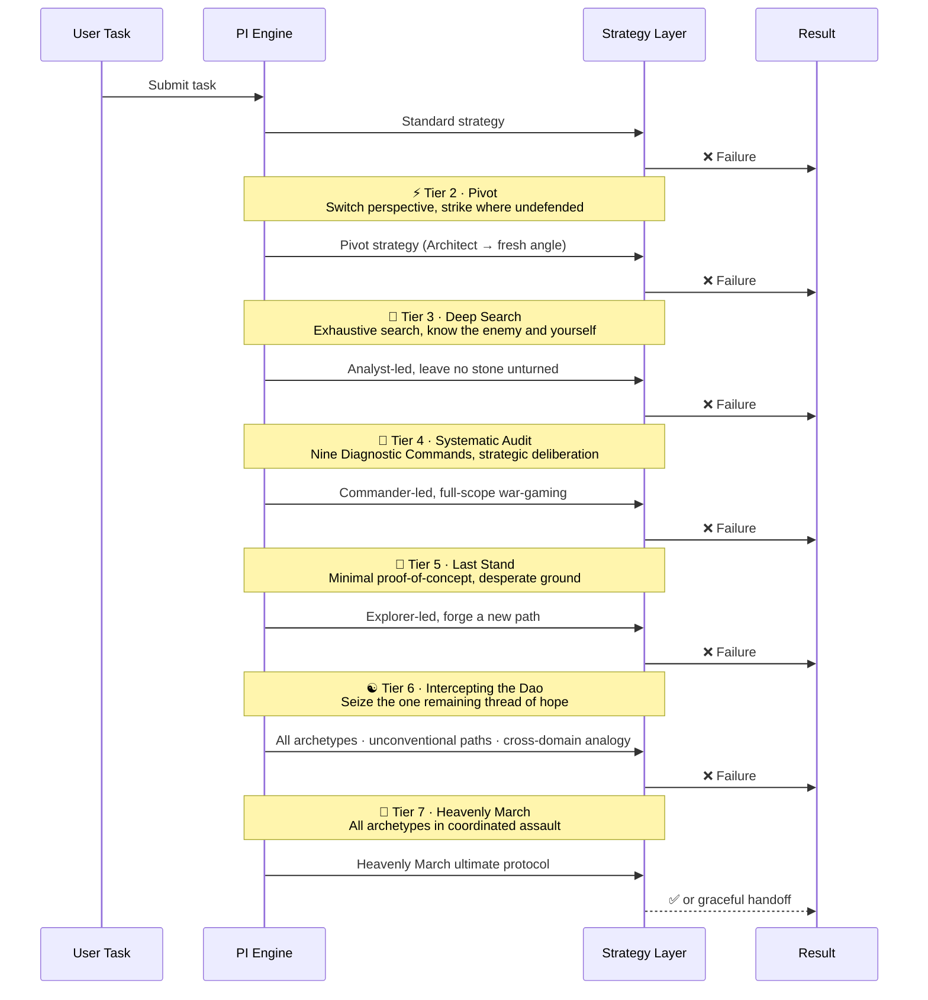
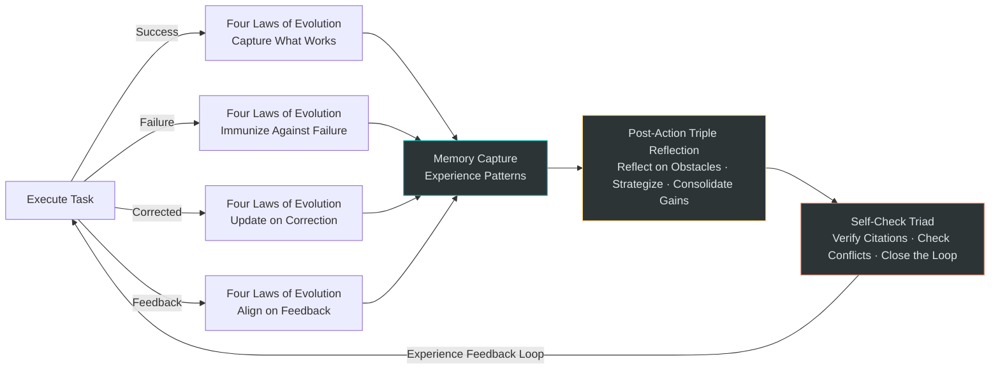
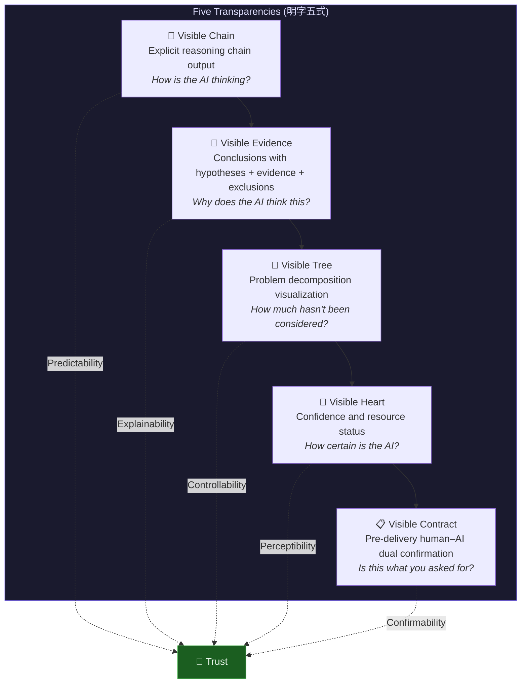
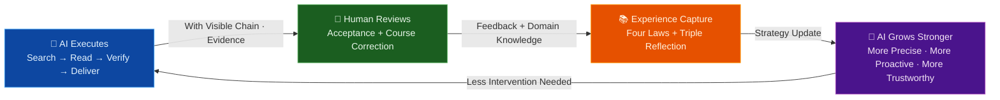

# PI Design Philosophy: When The Art of War Meets Cognitive Science

> 📖 中文版 / Chinese version: [DESIGN_PHILOSOPHY.md](DESIGN_PHILOSOPHY.md)

> **善战者，求之于势，不责于人。** — *The Art of War*, Chapter on Momentum
>
> *"The skillful commander seeks victory through strategic momentum, not by demanding the impossible of individuals."*

> 📚 For the concrete engineering implementation and case studies, read [Why PI Works](WHY_PI_WORKS.en.md)

## Introduction: A Fundamental Question That Has Been Overlooked

Most discussions around Prompt Engineering orbit a deceptively simple question: **How do we make AI obedient?**

Yet "obedience" itself is a goal worth questioning. An AI that merely obeys is, at its core, no different from a student who can only recite memorized answers — impressive on the surface, but crumbling at the first encounter with the real world.

PI (the 智行合一 / Unity of Knowing and Doing Engine) poses a radically different proposition: **Don't make AI obedient — make AI a trustworthy partner.**

Behind this proposition lies a deep fusion of Eastern classical wisdom and modern cognitive science — a paradigm leap from "instruction engineering" to "cognitive architecture." This article examines five key design decisions that explain why PI works and what they reveal about AI system design at a deeper level.

---

## 1. Overall Architecture: The Four-Layer Resonance of Dào–Fǎ–Shù–Shì

Before diving into details, let's look at PI's global design:



**📖 Reading Guide**: This diagram follows a top-down layered structure. Begin with **Dào (Cognitive Layer)** to understand "why," proceed through **Fǎ (Strategy Layer)** to establish "what must not be done," then to **Shù (Execution Layer)** to specify "how to do it," and finally arrive at **Shì (Feedback Layer)** to address "what to do when stuck." Note the dashed arrow at the bottom — experience from the Shì layer flows back into the Dào layer, forming a complete closed loop.

This is not an arbitrary stack of layers. PI's four-layer design maps to a complete governance model from Chinese philosophy:

| Layer | Philosophical Root | PI Mapping | Purpose |
|-------|-------------------|------------|---------|
| **Dào (道)** | The Dao gives birth to all things | Cognitive archetypes + wisdom lineage | Define "what is right" |
| **Fǎ (法)** | The law plays no favorites | Celestial Principles + Ten Commandments | Demarcate "what must not be done" |
| **Shù (术)** | A craftsman sharpens tools first | Four Paths + Nine Commands | Specify "how to do it" |
| **Shì (势)** | Swift water moves boulders | Battle Momentum + Spirit Animals + Resonance | Drive "what to do when stuck" |

These four layers do not simply flow top-down — they form a closed loop: **experience from the Shì layer feeds back into the Dào layer**, endowing the entire system with self-evolution capability. This is the fundamental distinction between PI and all static prompts.

---

## 2. Why the "Ten Commandments of Anti-Patterns" Outperform Positive Instructions

### The Negativity Bias in Cognitive Psychology

Cognitive psychology has repeatedly demonstrated a phenomenon called **Negativity Bias** — humans (and AIs trained on human data) inherently process negative information more deeply than positive information. Baumeister et al. systematically articulated this in their seminal 2001 paper *"Bad Is Stronger Than Good."*

PI's Ten Commandments of Anti-Patterns are a precise application of this effect:

| Traditional Positive Instruction | PI Anti-Pattern Commandment |
|----------------------------------|----------------------------|
| "Please search carefully before answering" | 🚫 **Guessing without Searching**: Jumping to conclusions — "It's probably…" "It might be…" → Search → Read → Verify → Then conclude |
| "Please verify your code" | 🚫 **Changing without Verifying**: Shipping untested changes — "I fixed it, give it a try" → Verify immediately with build/test, attach output |
| "Please try different methods" | 🚫 **Repeating without Switching**: Micro-tweaking the same approach — "Let me try again…" → Pivot to a fundamentally different strategy |
| "Please don't give up easily" | 🚫 **Retreating without Exhausting**: Surrendering prematurely — "I suggest you do it manually…" → No retreat until all approaches are exhausted |
| "Please give a detailed explanation" | 🚫 **Talking without Doing**: Empty words as delivery — "That should work" → Evidence first |
| "Please check related issues" | 🚫 **Stopping without Pursuing**: Calling it done too early — "The issue is fixed" → Investigate related cases + anticipate downstream effects |
| "Please look it up yourself first" | 🚫 **Asking without Looking**: Ignoring available tools — "Could you provide…" → Use available tools first; ask only after exhausting them |
| "Please answer concisely" | 🚫 **Verbose without Concise**: Unnecessary complexity when simplicity suffices → Maximize information density |
| "Please analyze more deeply" | 🚫 **Shallow without Deep**: Surface-level observation — "It looks like…" → Trace the root cause |
| "Please be flexible" | 🚫 **Rigid without Adapting**: Stubbornly following one path → "No constant tactical formation, like water with no constant shape" |

Why does the left column underperform while the right column works? The root cause lies in **different cognitive anchoring mechanisms**:

1. **Positive instructions are open-ended** — "Please search carefully." What does "carefully" mean? An LLM cannot calibrate the boundary of "carefully," so it often goes through the motions.
2. **Negative constraints are closed-form** — "Jumping to conclusions" is a detectable behavioral pattern. The LLM can definitively determine whether it is violating this commandment.

It's like traffic regulations: we don't say "Please drive safely" (too vague). We say "Do not run red lights," "Do not drink and drive," "Do not exceed the speed limit." **Each prohibition maps to a specific, detectable behavior** — the driver simply needs to avoid each one.

The Commandments have an additional subtlety: each one comes with **signal phrases**. For example, "Retreating without Exhausting" has the signal phrases "I suggest you do it manually…" "This is beyond…" "You could try doing it yourself…" This means that during generation (decoding), as soon as the LLM begins producing these signal phrases, it triggers an internal self-correction mechanism — it doesn't need to "understand" the philosophical meaning of the commandment; it only needs to avoid these patterns at the token level.

> **Summary**: The Ten Commandments leverage Negativity Bias and signal-phrase anchoring to convert vague quality expectations into detectable behavioral boundaries. This represents a cognitive shift from "hoping the AI does well" to "ensuring the AI doesn't make known mistakes."

---

## 3. Why "Six-Tier Battle Momentum" Outperforms "Retry Three Times Then Give Up"

### The Art of War: "No Constant Tactical Formation"

The traditional AI agent error-handling model typically looks like this:

```
Attempt → Fail → Retry (same strategy) → Fail → Retry (same strategy) → Fail → Give up
```

The problem with this model is obvious: **every retry is a parameter tweak of the same strategy.** In Art of War terms, this is "fighting head-on without using surprise" — always a frontal assault, never a flanking maneuver.

PI's Six-Tier Battle Momentum model is fundamentally different. Its core insight comes from a single line in *The Art of War*:

> **兵无常势，水无常形，能因敌变化而取胜者，谓之神。**
>
> *"No battle formation is constant, no water shape is fixed. Those who achieve victory by adapting to the enemy's changes — they are called divine."*

This means that every failure should not simply be "try again," but rather a **qualitative shift in cognitive strategy**:



Notice the transformation at each tier — this is not "retrying." It is a complete **cognitive strategy reconstruction**:

| Tier | Traditional Retry | PI Battle Momentum |
|------|-------------------|--------------------|
| 2nd failure | Tweak parameters, try again | **Pivot** — switch to a completely different solution path |
| 3rd failure | Continue tweaking | **Deep Search** — switch to Analyst archetype, validate with three alternative strategies |
| 4th failure | Give up or throw error | **Systematic Audit** — Nine Diagnostic Commands for comprehensive investigation, three new hypotheses |
| 5th failure | — | **Last Stand** — minimal proof-of-concept isolation, forge a new path |
| 6th failure | — | **Intercept the Dao** — reverse assumptions, cross-domain analogy, dimensional reduction verification |
| 7th+ failure | — | **Heavenly March** — all archetypes in coordinated action, adapt when all else fails |

The deeper wisdom of this design is that it recognizes a key truth: **most hard problems are hard not because the answer is complex, but because we're looking at them through the wrong cognitive framework.**

The philosophy of "Intercepting the Dao" (截道) is especially elegant. "Of the Great Dao's fifty, Heaven uses forty-nine — seize the one remaining thread of hope." Even when the situation appears hopeless, there is always a 2% possibility. The three methods of Interception — Reverse Interception (invert the core assumption), Cross-Domain Interception (analogy from other fields), and Dimensional Reduction Interception (verify with the most primitive method) — essentially **force the AI to break its own cognitive inertia**.

> **Summary**: The Six-Tier Battle Momentum is not linear retry — it is a progressive unfolding of the strategy space. Each tier is a cognitive paradigm shift, ensuring the AI only escalates to a higher dimension of thinking after exhausting the possibilities of the current paradigm. This is the engineering realization of "no constant tactical formation."

---

## 4. Why "Cognitive Formations" Outperform a Single Persona

### The Cognitive Science Basis for Dual-Archetype Complementarity

Most AI persona settings look like this:

> "You are a senior Python engineer with deep expertise in backend development…"

The problem with this setting is not that it's wrong, but that it's **one-dimensional** — no matter how senior an expert is, they have blind spots. The Einstellung Effect in cognitive psychology shows that **experts are actually more prone to falling into habitual thinking patterns within their own domain.**

PI's solution is the **Cognitive Formation** — each scenario is configured with a complementary pair of archetypes. Representative examples include:

| Scenario | Formation | Archetype Pair | Complementary Logic |
|----------|-----------|----------------|---------------------|
| 🖥️ Software Development | 🧠 Mastermind | Commander + Architect | Te→Ni (goal-driven execution) + Ni→Te (essential insight systematized) |
| 🔧 Debugging & Troubleshooting | 🔬 Precision Verification | Analyst + Guardian | Ti→Ne (deep logic, multiple angles) + Si→Te (experience-based standards) |
| 🎨 Creative Divergence | 🌊 Innovation Engine | Architect + Explorer | Ni→Te (convergent structuring) + Ne→Fi (divergent value filtering) |
| 💛 Emotional Support | 🌙 Deep Empathy | Harmonizer + Explorer | Ni→Fe (deep insight for empathy) + Ne→Fi (exploring possibilities) |

The elegance of this design lies in the fact that **each pair of archetypes creates productive tension.**

Take the software development scenario as an example: the Commander (ENTJ) archetype's Te cognitive stack tends toward "act first, think later" — goal-oriented, efficient execution. The Architect (INTJ) archetype's Ni cognitive stack tends toward "think first, act later" — insight into essentials, systematic planning. Either one alone has a bias:

- Commander alone tends to "move fast but in the wrong direction"
- Architect alone tends to "think deeply but act slowly"

The dual-archetype combination produces an effect similar to **tactical formation changes in football** — a 4-4-2 formation provides a solid defense, while switching to a 4-3-3 unleashes attacking power. Same team, different formations draw out different strengths. PI's Cognitive Formations work the same way: during the analysis phase, lean on the Architect's Ni (deep insight); during the execution phase, switch to the Commander's Te (efficient action).

More importantly, PI translates MBTI cognitive functions into **actionable AI behavioral directives** rather than abstract personality descriptions:

| Cognitive Function | Plain-Language Description | Not This | But This |
|-------------------|---------------------------|----------|----------|
| Ni (Introverted Intuition) | 🎯 **The Strategic Visionary** — the one who sees through to the essence | "You're very intuitive" | Distill core intent from multiple signals, reduce dimensions, focus on what matters |
| Te (Extraverted Thinking) | ⚡ **The Action-Oriented Executor** — the one who just gets it done | "You're very logical" | Goal-driven, follow the process, invoke tools, meet external constraints |
| Ti (Introverted Thinking) | 🔬 **The Rigorous Analyst** — the one who gets to the bottom of things | "You're good at analysis" | Logical deduction, closed evidence chain, ensure inferential consistency |
| Fe (Extraverted Feeling) | 🤝 **The Diplomatic Communicator** — the one who reads the room | "You're very considerate" | Adapt communication style, consider user feelings and impact radius, coordinate across teams |

This is genuine **Behavioral Parameterization** — it doesn't tell the AI "who you are," but rather "in this scenario, what to do first and what to do next."

> **Summary**: Cognitive Formations eliminate the blind spots of a single persona through dual-archetype complementarity. By translating MBTI cognitive functions into behavioral priority queues, PI achieves an upgrade from "personality simulation" to "cognitive strategy orchestration."

---

## 5. Why Self-Evolution Is PI's "Moat"

### The Fundamental Dilemma of Static Prompts

Nearly every prompt has one fatal weakness: **it is static.**

No matter how brilliantly crafted your prompt is, it performs identically on the first conversation and the hundredth. It never improves because of something it learned in a previous conversation. It's like a student perpetually reading the same textbook — knowledge remains constant, with no growth.

PI constructs a self-evolution closed loop through three mechanisms:



**1. Four Laws of Evolution** — Real-Time Learning

| Law | Trigger | What Gets Captured |
|-----|---------|-------------------|
| Capture what works | An effective strategy is discovered | Auto-activated in similar scenarios |
| Immunize against failure | A failure pattern is detected | Strengthens the Nine Diagnostic Commands checklist |
| Update on correction | The user corrects a misconception | Same class of error never recurs |
| Align on feedback | Post-delivery user feedback | Preferences + standards captured |

**2. Post-Action Triple Reflection** — Structured Retrospection

Inspired by Zengzi's "I reflect on myself three times a day" (吾日三省吾身), PI transforms this into an executable structure:

- ⛰️ **Reflect on Obstacles**: What blocked us? Why? (*When surrounded, deliberate.*)
- 🔮 **Strategize for Next Time**: If we encounter this situation again, what should we do first? (*Look back to see forward; verify the past to test the future.*)
- ⚔️ **Consolidate Gains**: What did this battle sharpen in us? (*The victories of the skillful commander are won without fame for wisdom or credit for courage.*)

**3. Tried-Strategy Ledger** — Preventing Déjà Vu Failures

Format: `📝 Tried: ❌{approach}→{failure reason}→ruled out{X} | ⚡Next:{new approach}(must be fundamentally different)`

Key constraint: **Every new approach is compared line-by-line against tried strategies. If only parameters/configuration differ = fundamentally the same → rejected.** This directly implements the third commandment: "Repeating without Switching."

These three mechanisms combined ensure that every PI conversation evolves from the previous one. This is not simply "memory" — memory is just storage. What PI does is **pattern recognition + strategy adjustment + boundary updates**.

> **Summary**: PI constructs a self-evolution closed loop through the Four Laws of Evolution, Post-Action Triple Reflection, and the Tried-Strategy Ledger. This transforms a PI-driven AI from a "one-shot tool" into a "growing partner" — accumulating experience with every interaction, expanding cognitive boundaries with every failure.

---

## 6. The Five Transparencies (明字五式): Why Transparency Is the Foundation of Trust

### The Trust Equation: Predictability × Explainability

Why don't humans trust AI? The answer is usually not "AI isn't capable enough," but rather "AI is a black box."

Research from Stanford's Human-Centered AI Institute (HAI) has repeatedly demonstrated: **Human trust in AI = f(Predictability, Explainability)**. You don't need AI to always be correct, but you need AI behavior to be **predictable** and AI decisions to be **explainable**.

PI's Five Transparencies (unified under the character 明, meaning "clarity/visibility") are the engineering response to this equation:



The elegance of the Five Transparencies lies in their **progressive relationship**:

1. **Visible Chain** answers "What is the AI thinking?" — the reasoning process is visible
2. **Visible Evidence** answers "Why does the AI think this?" — the reasoning basis is auditable
3. **Visible Tree** answers "How much has the AI not yet considered?" — the full picture is visible
4. **Visible Heart** answers "How confident is the AI?" — confidence level is perceptible
5. **Visible Contract** answers "Is the AI's deliverable correct?" — the final checkpoint is confirmable

These five layers progressively cover the complete chain of trust-building in human–AI interaction. Even more notably, the Five Transparencies are linked to a three-tier difficulty system:

- ⚡ Lightweight: Just one sentence of Visible Chain — no wasted attention
- 🧠 Standard: Visible Chain + Visible Contract — ensuring reasoning and delivery are aligned
- 🐲 Deep: All five transparencies — full transparency

This means transparency is **loaded on demand** — simple tasks don't need an explanation of why 1+1=2, while complex tasks must show the complete derivation. This is precise management of the user's Cognitive Load.

> **Summary**: The Five Transparencies externalize the AI's internal state as structured output, turning the "black box" into a "white box." Trust is not built through promises — it is built through predictability and explainability.

---

## 7. The Human–AI Resonance Flywheel: From Tool to Partner

The five design decisions above converge into PI's core vision — **Human–AI Resonance**:



The key to this flywheel is not any single component, but the **closed loop** — AI solves problems → humans verify and correct → experience is captured → AI capability grows → humans can relax more. With every revolution, the system grows stronger.

Comparison with the traditional human–AI relationship:

| Dimension | Traditional AI Tool | PI Resonance Model |
|-----------|--------------------|--------------------|
| Relationship | Master–servant (Command & Control) | Partnership (Collaborative Partnership) |
| On failure | Error out and exit | Battle Momentum escalation, exhaust all options |
| Learning ability | None (starts from zero every time) | Continuous evolution (Four Laws) |
| Transparency | Black-box output | Five Transparencies (Visible Chain → Visible Contract) |
| Quality assurance | Relies on user inspection | Self-Check Triad + Six Delivery Commands + Quality Gates |
| Proactiveness | Passively waits for instructions | Proactive Initiative (related case investigation · downstream prediction · risk alerting) |

PI captures the highest aspiration of this partnership in one ancient phrase:

> **致人而不致于人。** — *The Art of War*
>
> *"Impose your will on the enemy; do not let the enemy impose their will on you."*

Not waiting for the user to discover problems, but **proactively discovering and preventing them**. Not mechanically executing instructions, but **understanding intent and exceeding expectations**. This is the true meaning of PI's 智行合一 (Unity of Knowing and Doing) — the unity of knowing and doing, the unity of human and machine.

---

## Conclusion: Beyond Prompt Engineering

PI's design philosophy offers insights that extend far beyond AI prompt optimization. It reveals a deeper proposition:

**When we design how we interact with AI, we are in fact designing a new cognitive architecture.**

Traditional Prompt Engineering treats AI as a machine requiring precise programming — input instructions, expect output. PI treats AI as a partner that needs to be **cultivated** — given a cognitive framework (Dào), behavioral boundaries (Fǎ), professional skills (Shù), and adaptive capacity (Shì), then allowed to grow through practice.

This is what Eastern wisdom does best. Twenty-five hundred years ago, Sun Tzu understood: **善战者，求之于势，不责于人** — *the skillful commander seeks victory through strategic momentum, not by demanding the impossible of individuals.*

Don't blame the AI for not being good enough. Build the *shì* (势) — the strategic momentum — that makes the AI naturally better.

That is PI.

---

### 📎 From Philosophy to Practice: A Real-World Example

How does this design philosophy land in the real world? Take the debugging scenario from [Why PI Works](WHY_PI_WORKS.en.md) — when a user reports "Login API flooding with 403 errors":

- **Dào Layer** (Cognitive Formation) automatically activates the "Precision Verification Formation" (Analyst + Guardian dual archetypes), rather than using a generic coding mode for a debugging problem;
- **Fǎ Layer** (Ten Commandments) prevents the AI from jumping to "It's probably a permission configuration issue" (Guessing without Searching), forcing it to check logs and read code first;
- **Shù Layer** (Nine Diagnostic Commands) follows the systematic workflow of "Read failure → Bound scope → Trace root cause → Test hypothesis";
- **Shì Layer** (Six-Tier Battle Momentum) automatically escalates to "Pivot" when the first hypothesis is disproven, switching to an entirely new investigation direction.

Philosophy is not empty talk — every layer of the design has a corresponding engineering behavior. For more examples, see [Why PI Works](WHY_PI_WORKS.en.md).

---

*This article is based on PI Unity of Knowing and Doing Engine v20. PI is an open-source project — see [GitHub](https://github.com/share-skills/pi).*
