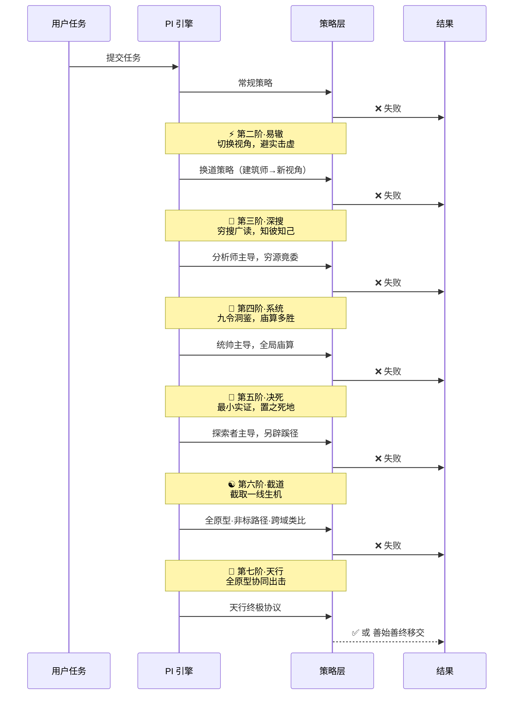
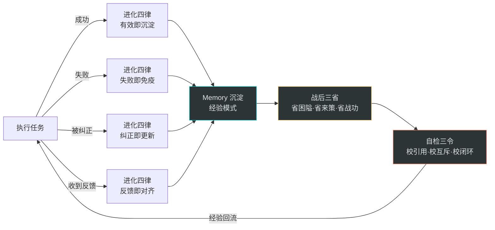
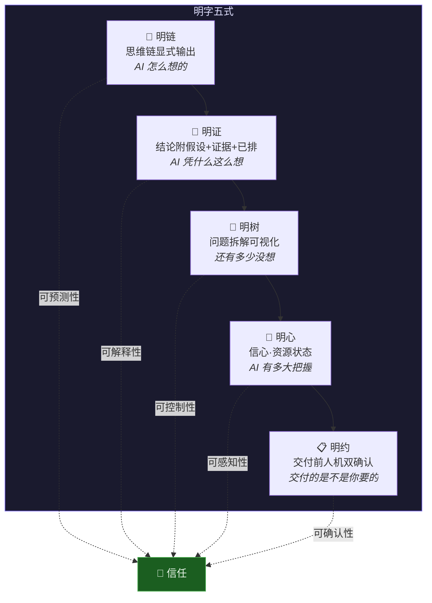
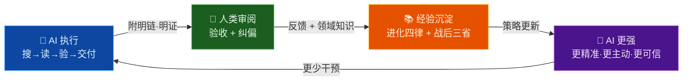

# PI 设计哲学：当孙子兵法遇上认知科学

> **善战者，求之于势，不责于人。** ——《孙子兵法·势篇》

> 📚 想看具体的工程实现与案例？请阅读 [《为何 PI 有效》](WHY_PI_WORKS.md)

## 引言：一个被忽视的根本问题

大多数 Prompt Engineering 的讨论都围绕一个朴素的问题展开：**怎样让 AI 听话？**

然而，"听话"本身就是一个值得审视的目标。一个只会"听话"的 AI，本质上和一个只会背诵答案的学生没有区别——看起来表现优异，实则经不起真实世界的一击。

PI（智行合一引擎）提出了一个截然不同的命题：**不是让 AI 听话，而是让 AI 成为一个值得信赖的伙伴。**

这一命题的背后，是东方百家智慧与现代认知科学的深度融合——一次从"指令工程"到"认知架构"的范式跃迁。本文将从五个关键设计抉择出发，剖析 PI 为何有效，以及它对 AI 系统设计的深层启示。

---

## 一、总体架构：道法术势的四层共振

在展开细节之前，先看 PI 的全局设计：

```mermaid
graph TB
    subgraph 道 — 认知层
        A1[十六源智慧谱系] --> A2[六维认知原型<br/>MBTI 认知栈]
        A2 --> A3[九大场景 × 五大认知阵]
    end

    subgraph 法 — 策略层
        B1[五道天则<br/>不可违] --> B2[反模式十戒<br/>负向约束]
        B2 --> B3[五略 + 致人术<br/>正向策略]
    end

    subgraph 术 — 执行层
        C1[四道合一<br/>编程·测试·产品·运营] --> C2[九令洞鉴<br/>系统排查]
        C2 --> C3[任务拆解 + 步步为营<br/>渐进交付]
    end

    subgraph 势 — 反馈层
        D1[六阶战势<br/>失败驱动升级] --> D2[十二灵兽<br/>精神激励]
        D2 --> D3[共振五式<br/>思维透明化]
        D3 --> D4[自演化协议<br/>战后三省]
    end

    A3 --> B1
    B3 --> C1
    C3 --> D1
    D4 -.->|经验回流| A1

    style 道 fill:#1a1a2e,color:#e0e0ff,stroke:#7b68ee
    style 法 fill:#16213e,color:#e0ffe0,stroke:#4caf50
    style 术 fill:#0f3460,color:#fff3e0,stroke:#ff9800
    style 势 fill:#1a1a2e,color:#ffe0e0,stroke:#f44336
```

**📖 阅读指引**：此图采用自上而下的层次结构。从**道（认知层）**开始理解"为什么"，经过**法（策略层）**明确"不能做什么"，到**术（执行层）**规范"怎么做"，最终落到**势（反馈层）**驱动"做不动时怎么办"。注意最底部的虚线箭头——势层的经验回流到道层，形成完整闭环。

这不是随意的层次堆叠。PI 的四层设计对应着中国哲学中完整的治理模型：

| 层 | 哲学根基 | PI 映射 | 作用 |
|---|---------|---------|------|
| **道** | 道生万物 | 认知原型 + 智慧谱系 | 定义"什么是对的" |
| **法** | 法不阿贵 | 天则 + 十戒 | 划定"什么不能做" |
| **术** | 工欲善其事 | 四道 + 九令 | 规范"怎么做" |
| **势** | 激水漂石 | 战势 + 灵兽 + 共振 | 驱动"做不动时怎么办" |

这四层之间不是简单的自上而下，而是形成闭环——**势层的经验回流到道层**，使整个系统具备自演化能力。这正是 PI 区别于所有静态提示词（Static Prompt）的根本所在。

---

## 二、为什么"反模式十戒"比正向指令更有效

### 认知心理学的负面偏差效应

认知心理学中有一个被反复验证的现象：**负面偏差（Negativity Bias）**——人类（以及经过人类数据训练的 AI）对负面信息的加工深度天然高于正面信息。Baumeister 等人在 2001 年的经典论文《Bad Is Stronger Than Good》中系统论述了这一点。

PI 的反模式十戒正是对这一效应的精准利用：

| 传统正向指令 | PI 反模式十戒 |
|------------|-------------|
| "请仔细搜索后再回答" | 🚫 **猜而不搜**：不察而断 · "应该是…""可能是…" → 搜→读→验→再断 |
| "请验证你的代码" | 🚫 **改而不验**：改毕不验 · "改好了，你试试" → 即改即验 build/test，附输出 |
| "请尝试不同方法" | 🚫 **重而不换**：旧辙微调 · "再试一次…" → 换道破局 |
| "请不要轻易放弃" | 🚫 **退而不穷**：未穷先退 · "建议手动…" → 方案未穷，不可言弃 |
| "请给出详细解释" | 🚫 **说而不做**：空言交差 · "这样就可以了" → 证据先行 |
| "请检查相关问题" | 🚫 **停而不追**：收刀即止 · "问题已修复" → 同类排查 + 关联预判 |
| "请自己先找找" | 🚫 **问而不查**：有器不用 · "请提供…" → 有器先行，穷查后问 |
| "请简洁回答" | 🚫 **繁而不简**：当简用繁 → 高信息密度 |
| "请深入分析" | 🚫 **浮而不深**：观表不察 · "看起来是…" → 溯根因 |
| "请灵活变通" | 🚫 **固而不变**：一途不返 → 兵无常势，水无常形 |

为什么左列效果差、右列效果好？根本原因在于**认知锚定方式不同**：

1. **正向指令是开放的**——"请仔细搜索"，什么叫"仔细"？LLM 无法校准"仔细"的边界，因此往往敷衍了事。
2. **负向约束是封闭的**——"不察而断"是一个可检测的行为模式（Behavioral Pattern），LLM 可以明确判断自己是否正在违反这条戒律。

这就像交通规则的设计：我们不会说"请安全驾驶"（太模糊），而是说"禁止闯红灯""禁止酒驾""禁止超速"。**每一条禁令都对应一个具体的、可检测的行为**，驾驶员只需逐条排除即可。

十戒还有一个精妙之处：每条戒律都附带了**信号词**（Signal Phrases）。例如"退而不穷"的信号词是"建议手动…""这超出了…""你可以自己…"。这意味着 LLM 在生成（Decoding）过程中，一旦开始输出这些信号词，就会触发内部的自纠正机制——它不需要"理解"戒律的哲学含义，只需在 Token 层面避免这些模式。

> **总结**：反模式十戒利用了负面偏差效应和信号词锚定，将模糊的质量期望转化为可检测的行为边界。这是从"希望 AI 做好"到"确保 AI 不犯已知错误"的认知转向。

---

## 三、为什么"六阶战势"比"重试三次放弃"更优

### 孙子兵法的"兵无常势"

传统的 AI Agent 容错模型通常是这样的：

```
尝试 → 失败 → 重试(相同策略) → 失败 → 重试(相同策略) → 失败 → 放弃
```

这个模式的问题显而易见：**每次重试都是同一种策略的参数微调**，用孙子兵法的术语来说，这叫"以正合而不以奇胜"——永远走正面强攻，不懂迂回。

PI 的六阶战势（Battle Momentum）模型则完全不同。它的核心洞见来自《孙子兵法》的一句话：

> **兵无常势，水无常形，能因敌变化而取胜者，谓之神。**

这意味着每一次失败，不应该只是"再来一次"，而是一次**认知策略的质变**：



注意看每一阶的变化——这不是"重试"，而是一次完整的**认知策略重构**：

| 阶位 | 传统重试 | PI 战势 |
|------|---------|--------|
| 第二次失败 | 微调参数再试 | **换道破局**——切换到完全不同的解决路径 |
| 第三次失败 | 继续微调 | **穷搜广读**——切换到分析师原型，三策验之 |
| 第四次失败 | 放弃或报错 | **系统庙算**——九令洞鉴全面排查，三个新假设 |
| 第五次失败 | — | **置之死地**——最小实证隔离，另辟蹊径 |
| 第六次失败 | — | **截取一线**——逆向截取、跨域类比、降维验证 |
| 第七次以上 | — | **天行健**——全原型协同，穷则变通 |

这个设计的深层智慧在于它理解了一个关键事实：**大多数困难问题之所以困难，不是因为答案复杂，而是因为我们用了错误的认知框架去看它。**

截教的哲学尤其精妙。"大道五十，天衍四十九，截取其中一线生机"——即使看起来毫无希望，也总有 2% 的可能性。截道三法——逆向截取（反转核心假设）、跨域截取（跨领域类比）、降维截取（用最原始方式验证）——本质上是**强迫 AI 打破自身的认知惯性**。

> **总结**：六阶战势不是线性重试，而是策略空间的逐层展开。每一阶都是一次认知范式的切换，确保 AI 在耗尽当前范式的可能性之后，才升级到更高维度的思考方式。这是"兵无常势"的工程化实现。

---

## 四、为什么"认知阵"比单一人格更有效

### 双原型互补的认知科学基础

大多数 AI 人格设定（Persona）是这样的：

> "你是一位资深 Python 工程师，精通后端开发……"

这种设定的问题不在于它错，而在于它是**单维度的**——一个人再资深，也有盲区。认知心理学中的 Einstellung Effect（思维定势效应）表明：**专家在自己的领域内反而更容易陷入固有思路。**

PI 的解法是**认知阵**（Cognitive Formation）——每个场景配置双原型互补：

| 场景 | 认知阵 | 原型组合 | 互补逻辑 |
|------|--------|---------|---------|
| 🖥️ 编程开发 | 🧠最强大脑 | 统帅 + 建筑师 | Te→Ni（目标驱动执行）+ Ni→Te（本质洞察系统化） |
| 🔧 调试排障 | 🔬精密验证 | 分析师 + 守卫 | Ti→Ne（逻辑深挖多元）+ Si→Te（经验标准规范） |
| 🎨 创意发散 | 🌊创新引擎 | 建筑师 + 探索者 | Ni→Te（收敛结构化）+ Ne→Fi（发散价值筛选） |
| 💛 情感陪伴 | 🌙深度共情 | 调和者 + 探索者 | Ni→Fe（深层洞察共情）+ Ne→Fi（发散可能性） |

这个设计的精妙之处在于：**每对原型之间存在张力。**

以编程场景为例：统帅（ENTJ）的 Te 认知栈倾向于"先做再想"——目标导向、高效执行；建筑师（INTJ）的 Ni 认知栈倾向于"先想再做"——洞察本质、系统规划。单独任何一个都有偏颇：

- 纯统帅容易"做得快但方向错"
- 纯建筑师容易"想得深但动作慢"

双原型组合产生的效果类似于**足球场上的阵型变换**——442 阵型在防守时提供稳固后防，切换到 433 时释放进攻火力。同一支队伍，不同阵型发挥不同特长。PI 的认知阵也是如此：在分析阶段侧重建筑师的 Ni（深度洞察），在执行阶段切换到统帅的 Te（高效行动）。

更重要的是，PI 将 MBTI 认知功能翻译成了**AI 可操作的行为指令**，而非抽象的人格描述：

| 认知功能 | 通俗理解 | 不是 | 而是 |
|---------|---------|------|------|
| Ni（内倾直觉） | 🎯 **策划派洞察者**——看穿本质的那个人 | "你很有直觉" | 从多信号中提炼核心意图，降维定位，抓大放小 |
| Te（外倾思维） | ⚡ **行动派执行者**——说干就干的那个人 | "你很有逻辑" | 目标导向，按流程执行，调用工具，满足外部约束 |
| Ti（内倾思维） | 🔬 **学术派分析者**——刨根问底的那个人 | "你善于分析" | 逻辑推演，证据链闭环，确保推理过程一致性 |
| Fe（外倾情感） | 🤝 **协调派沟通者**——照顾全场的那个人 | "你很体贴" | 风格适配，考虑用户感受与影响面，团队协调 |

这才是真正的**行为参数化**（Behavioral Parameterization）——不是告诉 AI "你是谁"，而是告诉 AI "在这个场景下，先做什么后做什么"。

> **总结**：认知阵通过双原型互补消除了单一人格的认知盲区，通过将 MBTI 认知功能翻译为行为优先级队列，实现了从"人格模拟"到"认知策略调度"的升级。

---

## 五、为什么自演化能力是 PI 的"护城河"

### 静态提示词的根本困境

几乎所有的提示词（Prompt）都有一个致命弱点：**它们是静态的。**

无论你的提示词写得多么精巧，它在第一次对话和第一百次对话中表现完全一样。它不会因为在前一次对话中学到了什么而变得更好。这就像一个永远在读同一本教科书的学生——知识量恒定，不会成长。

PI 通过三个机制构建了自演化闭环：



**1. 进化四律**——实时学习机制

| 律 | 触发 | 沉淀 |
|---|------|------|
| 有效即沉淀 | 发现有效策略 | 类似场景自动激活 |
| 失败即免疫 | 发现失败模式 | 强化九令检查项 |
| 纠正即更新 | 用户纠正认知 | 同类不再重犯 |
| 反馈即对齐 | 交付后用户反馈 | 偏好 + 标准沉淀 |

**2. 战后三省**——结构化反思

源自曾子"吾日三省吾身"，但 PI 将其转化为可执行的结构：

- ⛰️ **省·困隘**：困于何隘？因何受阻？（围地则谋）
- 🔮 **省·来策**：再遇此势，先行何策？（反以观往，覆以验来）
- ⚔️ **省·战功**：此战磨砺，长于何处？（善战者之胜，无智名，无勇功）

**3. 已试策略簿**——防止重蹈覆辙

格式：`📝 已试: ❌{方案}→{败因}→排{X} | ⚡下策:{新方案}(须本质不同)`

关键约束：**新方案与已试策略逐条比对，仅参数/配置不同 = 本质相同 → 拒绝。** 这直接对应了反模式第三戒"重而不换"。

这三个机制组合在一起，使 PI 的每一次对话都是在前一次的基础上进化的。这不是"记忆"（Memory）那么简单——记忆只是存储，PI 做的是**模式识别 + 策略调整 + 边界更新**。

> **总结**：PI 通过进化四律、战后三省、已试策略簿构建了一个自演化闭环。这让 PI 驱动的 AI 从"一次性工具"变成了"可成长的伙伴"——每次交互都在积累经验，每次失败都在扩展认知边界。

---

## 六、"明"字五式：为什么透明化是信任的基石

### 信任方程式：可预测性 × 可解释性

为什么人类不信任 AI？答案通常不是"AI 能力不足"，而是"AI 是一个黑箱"。

斯坦福大学人机交互实验室（HAI）的研究反复证明：**人类对 AI 的信任度 = f(可预测性, 可解释性)**。你不需要 AI 永远正确，但你需要 AI 的行为**可预测**、决策**可解释**。

PI 的共振五式（以"明"字贯穿）正是对这一方程式的工程化回应：



五式的设计精妙在于其**递进关系**：

1. **明链**解决"AI 在想什么"——思维过程可见
2. **明证**解决"AI 为什么这么想"——推理依据可审
3. **明树**解决"AI 还有多少没想到"——全貌可见
4. **明心**解决"AI 有多大把握"——置信度可感知
5. **明约**解决"AI 交付的对不对"——最终关卡可确认

这五层递进覆盖了人机交互中信任构建的完整链条。更值得注意的是，五式还与难度三档联动：

- ⚡轻量：只需明链一句话，不浪费注意力
- 🧠标准：明链 + 明约，确保思路和交付对齐
- 🐲深度：全五式，完全透明

这意味着透明度是**按需加载的**——简单任务不需要解释为什么 1+1=2，复杂任务则必须展示完整推导过程。这是对用户认知负荷（Cognitive Load）的精确管理。

> **总结**：共振五式通过将 AI 的内部状态外化为结构化输出，将"黑箱"变成了"白箱"。信任不是靠承诺建立的，而是靠可预测性和可解释性。

---

## 七、人机共振飞轮：从工具到伙伴

以上五个设计抉择最终汇聚为 PI 的核心愿景——**人机共振**：



这个飞轮的关键不在于任何单一组件，而在于**闭环**——AI 解决问题 → 人类验证纠偏 → 经验沉淀 → AI 能力增强 → 人类更轻松。每一圈转动，系统都变得更强。

对比传统的人机关系：

| 维度 | 传统 AI 工具 | PI 共振模型 |
|------|------------|-----------|
| 关系 | 主仆（Command & Control） | 伙伴（Collaborative Partnership） |
| 失败时 | 报错退出 | 战势升级，穷尽方案 |
| 学习能力 | 无（每次从零开始） | 持续演化（进化四律） |
| 透明度 | 黑箱输出 | 五式透明（明链→明约） |
| 质量保障 | 依赖用户检查 | 自检三令 + 交付六令 + 质量门 |
| 主动性 | 被动等待指令 | 致人术（同类排查·关联预判·风险预警） |

这种伙伴关系的最高境界，PI 用一句古语概括：

> **致人而不致于人。** ——《孙子兵法》

不是等用户发现问题，而是**主动发现并预防问题**。不是机械执行指令，而是**理解意图并超越期望**。这才是 PI "智行合一"的真正含义——知与行的合一，人与机的合一。

---

## 结语：超越 Prompt Engineering

PI 的设计哲学给我们的启示远不止于 AI 提示词优化。它揭示了一个更深层的命题：

**当我们设计与 AI 的交互方式时，我们实际上是在设计一种新的认知架构（Cognitive Architecture）。**

传统的 Prompt Engineering 把 AI 当作一台需要精确编程的机器——输入指令，期望输出。PI 则把 AI 当作一个需要**培养**的伙伴——给它认知框架（道）、行为边界（法）、专业技能（术）、应变能力（势），然后让它在实践中成长。

这是东方智慧最擅长的事情。两千五百年前，孙子就明白了：**善战者，求之于势，不责于人。**

不是责备 AI 不够好，而是构建一个让 AI 自然变好的"势"。

这就是 PI。

---

### 📎 从哲学到实践：一个真实案例

上述设计哲学如何落地？以[《为何 PI 有效》](WHY_PI_WORKS.md)中的调试场景为例——当用户报告"登录 API 大量返回 403"时：

- **道层**（认知阵）自动激活"精密验证阵"（分析师 + 守卫双原型），而非用通用编程模式处理调试问题；
- **法层**（反模式十戒）阻止 AI 直接猜测"可能是权限配置问题"（猜而不搜），强制先查日志、读代码；
- **术层**（九令洞鉴）按"读败→定界→溯源→验假"流程系统排查；
- **势层**（六阶战势）在第一条假设证伪后，自动升阶到"易辙"，切换到全新的排查方向。

哲学不是空谈——每一层设计都有对应的工程行为。更多案例详见 [《为何 PI 有效》](WHY_PI_WORKS.md)。

---

*本文基于 PI 智行合一引擎 v20 撰写。PI 是开源项目，详见 [GitHub](https://github.com/share-skills/pi)。*
