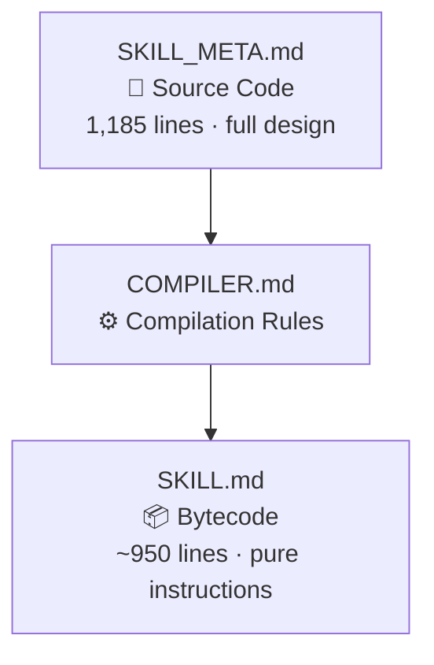
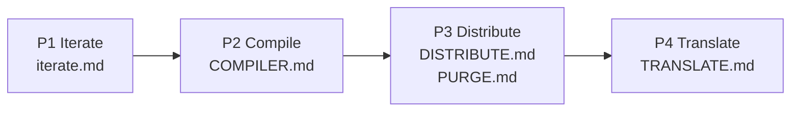

# Why an AI Skill Needs a Compiler

> **The Design Philosophy Behind PI's Compilation and Distribution System**

> 🌐 中文版：[WHY_COMPILER.md](WHY_COMPILER.md)
>
> 📚 Related reading: [Why PI Works](WHY_PI_WORKS.en.md) · [Design Philosophy](DESIGN_PHILOSOPHY.en.md)

PI ships across multiple platform targets — 6 in-repo platforms plus a Qoder adapter target — in 2 languages. The compilation and distribution system is what makes this possible without behavioral drift. This article explains why an AI skill needs a compiler at all, and how PI's build pipeline keeps everything in sync.

---

## 1. The Problem: Design Docs ≠ Runtime Instructions

PI's single source of truth is SKILL_META.md — currently 1,185 lines. It contains everything: behavioral instructions, cognitive strategies, design philosophy, classical Chinese references, worked examples, and rationale explanations.

But these serve two fundamentally different audiences:

| Audience | Needs | Doesn't need |
|----------|-------|-------------|
| **Human maintainers** | Philosophy, examples, "why" sections | — |
| **AI runtime** | Behavioral instructions, cognitive strategies, output templates | Classical quotes, thought lineage, design rationale |

Feeding all 1,185 lines to an AI model has three costs:

1. **Context noise**: Design rationale doesn't change the AI's next-token generation, but consumes context window budget
2. **Platform constraints**: Cursor, Kiro, Claude Code, and Copilot CLI all handle context differently
3. **Maintenance risk**: Editing a live deployment file risks accidentally breaking behavioral instructions while updating design commentary

This is a solved problem in software engineering. You don't deploy annotated source code to production — you compile it first.

---

## 2. The Solution: A Three-Layer Architecture

PI borrows the classic source → compiler → bytecode pattern:



| Layer | File | Analogy | Audience | Content |
|-------|------|---------|----------|---------|
| **Source** | SKILL_META.md | `.java` / `.ts` | Humans | Full design: philosophy + strategy + instructions + examples |
| **Bytecode** | SKILL.md | `.class` / `.js` | AI runtime | Pure behavioral instructions + cognitive strategies + output templates |

**Key insight**: This is not simple "trimming." The compiler performs **semantic classification** — keeping every line that changes the AI's behavior, stripping every line that only serves human understanding.

---

## 3. Why COMPILER.md Exists

Why write compilation rules as a standalone document instead of just "manually shortening" the file?

### 3.1 Reproducibility

Any model — Claude, GPT, Gemini, Qwen — can read COMPILER.md and produce a behaviorally equivalent SKILL.md from the same SKILL_META.md. The rules are deterministic, not model-dependent.

### 3.2 Auditability

Every stripping decision is explicit and justified:

| Stripped item | Reason |
|--------------|--------|
| Classical Chinese epigraphs (`> **...** ——《...》`) | Does not change AI behavior |
| `Classics` column in tables | Decorative; AI doesn't alter decisions based on it |
| `> Example:...` code blocks | Keep format templates, remove example instances |
| `**Essence**:...` paragraphs | Design intent for humans |
| `**Why do we need...?**` paragraphs | Design rationale |

No ambiguity. Each rule answers one question: **Does this content change the AI's next token?**

### 3.3 Separation of Concerns

- **Iterating** SKILL_META.md: focus on whether the design is correct
- **Compiling**: focus on whether behavioral instructions are intact
- **Distributing**: focus on whether platform formats are compliant

Three stages, zero interference. Designers can freely add philosophical annotations to META without worrying about runtime token costs.

### 3.4 Version Control

META change → compile → diff SKILL.md = you see exactly which **behaviors** changed. Design commentary edits don't pollute the behavioral diff.

---

## 4. The Distribution Pipeline

Compilation is step one. PI's full pipeline has four phases:



### 4.1 The Distribution Matrix

Compilation produces SKILL.md. Distribution deploys it across 6 in-repo platforms, with Qoder handled separately as an adapter target per `DISTRIBUTE.md`:

| Platform | Standard | PURGE | Special handling |
|----------|----------|-------|-----------------|
| skills/ | ✅ | Loop stripped | AgentSkills standard |
| claude-code/ | ✅ | Loop stripped | AgentSkills frontmatter |
| cursor/rules/ | ✅ | Loop stripped | `alwaysApply: true` |
| kiro/steering/ | ✅ | Loop stripped | `inclusion: auto` |
| openclaw/ | ✅ | Loop stripped | metadata as single-line JSON |
| copilot-cli/ | ✅ | **No stripping** | Retains Loop mode |
| qoder (adapter) | — | Loop stripped | name + description only |

### 4.2 PURGE: Platform-Specific Stripping

Why strip Loop mode from some platforms? Loop mode is designed for per-request billing platforms (Copilot CLI). On per-token billing platforms (Claude Code), Auto mode's three autonomy tiers already cover all interaction needs. Loop rules on those platforms are **dead code** — consuming tokens with zero effect.

PURGE's design principle: **never modify SKILL.md itself.** Stripping happens at distribution time. SKILL.md always retains the full instruction set.

### 4.3 Translation: CN → EN

The translation phase isn't word-for-word — it's strategy-based:

| Content type | Strategy | Example |
|-------------|----------|---------|
| Behavioral instructions | Precise meaning translation | "穷理尽性" → "Exhaust all possibilities" |
| Core concepts | Pinyin + explanation (first occurrence) | 道 (Dào), 势 (Shì), 截教 (Jiéjiào) |
| Spirit animals | English animal names | 🦅鹰 → 🦅Eagle |
| Emoji / labels | Preserved as-is | ⚡PI-01 stays unchanged |

### 4.4 The Final Output Matrix

```
6 in-repo platforms × 2 languages (CN + EN)
= up to 12 checked-in platform files
plus 1 Qoder adapter target handled separately via DISTRIBUTE.md
```

Every file's body traces back to the same SKILL_META.md, through the same deterministic compilation rules, guaranteeing **behavioral equivalence**.

---

## 5. Design Decisions and Trade-offs

### Why not just use one file?

Context window pressure. Roughly 20% of the 1,185-line design document is rationale that provides zero value to the AI runtime. Different platforms have different context sensitivity. The compiled version delivers higher information density per token.

### Why not auto-generate everything?

Every phase boundary has a **quality gate.** Post-compilation: line-by-line verification that no behavioral instruction was lost. Post-distribution: body consistency check across all 6 platforms. Post-translation: behavioral equivalence validation between CN and EN. Automation + human review = trustworthy output.

### Why keep the classical Chinese references at all?

They're not decoration. "以正合以奇胜" (yǐ zhèng hé yǐ qí shèng — "engage with the orthodox, win with the unorthodox") encodes precise behavioral semantics: "when the standard approach fails, forcibly switch to a fundamentally different solution." This is more precise than "try a different approach" because 奇 (qí) in its military context means **an unexpected flanking maneuver**, not "slightly different."

SKILL_META.md preserves these references as design foundations. COMPILER.md strips them at compile time (because the behavioral instructions already carry this semantics). Two layers, each with a clear job.

### Why is the compiler itself a Markdown file?

Because the compiler's executor is an AI. Markdown is the format AI models parse best — tables, lists, and code blocks all have unambiguous structural markers. Writing compilation rules in Markdown means AI can read them directly and execute them without an additional parsing layer.

---

## 6. Summary

PI's compilation and distribution system does one thing: **put design intent and runtime behavior where they each belong.**

- **SKILL_META.md** — the full design for humans, documenting *why*
- **COMPILER.md** — deterministic rules ensuring *compiled output preserves behavior*
- **SKILL.md** — pure behavioral instructions for AI, where every line matters
- **DISTRIBUTE.md + PURGE.md** — distribution pipeline ensuring *the 6 in-repo platforms stay in sync and align with the Qoder adapter rules*
- **TRANSLATE.md** — translation layer ensuring *CN and EN are behaviorally equivalent*

The question this system answers:

> **How do you make one AI skill specification produce consistent behavior across different platforms, different models, and different languages?**

The answer: treat it like software — with source code, a compiler, a distribution pipeline, and quality gates at every stage.
