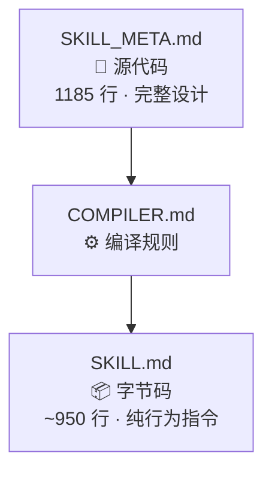
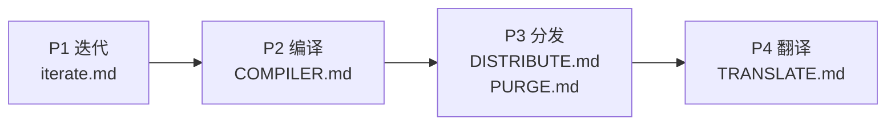

# 为什么 AI 技能需要编译器

> **Why an AI Skill Needs a Compiler: The Design Philosophy Behind PI's Build System**

> 🌐 English version: [WHY_COMPILER.en.md](WHY_COMPILER.en.md)
>
> 📚 延伸阅读：[《为何 PI 有效》](WHY_PI_WORKS.md) · [《PI 设计哲学》](DESIGN_PHILOSOPHY.md)

PI 的编译与分发系统不是"把大文件变小"那么简单。它本质上在回答一个问题：**如何让一份 AI 技能说明书稳定地部署到多个平台目标（仓库内 6 个主平台 + Qoder 适配）、两种语言，且行为完全一致？**

---

## 一、问题：设计文档 ≠ 运行指令

SKILL_META.md 是 PI 的唯一迭代真源，目前 1185 行。它包含：

- 行为指令（祈使句、触发条件、格式模板）
- 认知策略（MBTI 认知功能栈、认知阵、认知流管线）
- 设计哲学（古典引语、思想源、"为什么"段落）
- 示例与注解（具体场景示例、边界注解、联动说明）

这四类内容服务于两种完全不同的读者：

| 读者 | 需要什么 | 不需要什么 |
|------|---------|-----------|
| **人类维护者** | 设计哲学、示例、"为什么" | — |
| **AI 运行时** | 行为指令、认知策略、格式模板 | 古典引语、思想源、设计 rationale |

把 1185 行全量灌给 AI，有三个问题：

1. **上下文噪声**：设计 rationale 不改变 AI 的下一个 token 生成，但占用宝贵的上下文窗口
2. **平台限制**：不同平台（Cursor、Kiro、Claude Code）对 context size 的处理方式不同
3. **维护风险**：直接编辑运行文件，容易在修改设计意图时误改行为指令

这和软件工程中的经典问题一模一样：你不会把带注释的源码直接部署到生产环境。

---

## 二、解法：三层编译架构

PI 的解法是一个三层架构，借鉴软件编译的经典模式：



| 层级 | 文件 | 类比 | 读者 | 内容 |
|------|------|------|------|------|
| **源代码** | SKILL_META.md | `.java` / `.ts` | 人类维护者 | 完整设计：哲学 + 策略 + 指令 + 示例 |
| **字节码** | SKILL.md | `.class` / `.js` | AI 运行时 | 纯行为指令 + 认知策略 + 格式模板 |

**关键洞察**：这不是简单的"删减"。编译器做的是**语义分类裁剪**——保留每一条改变 AI 行为的指令，剥离每一段仅服务于人类理解的内容。

---

## 三、为什么需要 COMPILER.md

编译规则为什么要单独写成一个文件，而不是"随手精简"？四个原因：

### 3.1 可复现性

任何模型（Claude、GPT、Gemini、Qwen）读 COMPILER.md 后对 SKILL_META.md 执行编译，都应该产出行为等价的 SKILL.md。编译规则是确定性的，不依赖模型的"理解力"。

### 3.2 可审计性

编译规则是白纸黑字的：

| 剥离项 | 理由 |
|--------|------|
| 章节开头古典引语 | 不改变 AI 行为 |
| 表格中 `经典` 列 | 装饰性，AI 不因此改变决策 |
| `> 示例：...` 代码块 | 保留格式模板，删示例实例 |
| `**本质**：...` 段落 | 给人看的设计意图 |
| `**为什么需要...？**` 段落 | 设计 rationale |

没有"模型自行判断哪些该删"的模糊空间。每一条规则都有明确的判定标准：**这段内容是否改变 AI 的下一个 token 生成？**

### 3.3 关注点分离

- 迭代 SKILL_META.md 时，只关心设计是否正确
- 编译时，只关心行为指令是否完整
- 分发时，只关心平台格式是否合规

三个阶段互不干扰。设计者可以放心在 META 中添加哲学注解，不用担心"这会不会增加运行时 token 消耗"。

### 3.4 版本控制友好

META 改动 → 编译 → diff SKILL.md，可以精确看到哪些**行为**发生了变化。设计意图的修改不会污染行为变更的 diff。

---

## 四、分发管线：从一份源到全平台就绪

编译只是第一步。PI 的完整管线是四个阶段：



### 4.1 分发矩阵

编译产出 SKILL.md，分发阶段将其部署到 6 个仓库内主平台；Qoder 作为额外适配目标，按 `DISTRIBUTE.md` 单独处理：

| 平台 | 原版 | PURGE | 特殊处理 |
|------|------|-------|---------|
| skills/ | ✅ | Loop 裁剪 | AgentSkills 标准 |
| claude-code/ | ✅ | Loop 裁剪 | AgentSkills frontmatter |
| cursor/rules/ | ✅ | Loop 裁剪 | `alwaysApply: true` |
| kiro/steering/ | ✅ | Loop 裁剪 | `inclusion: auto` |
| openclaw/ | ✅ | Loop 裁剪 | metadata 单行 JSON |
| copilot-cli/ | ✅ | **不裁剪** | 保留 Loop 模式 |
| qoder（适配目标） | — | Loop 裁剪 | 仅保留 name + description |

### 4.2 PURGE：平台特化裁剪

为什么有些平台要裁剪 Loop 模式？因为 Loop 模式专为按请求计费平台（Copilot CLI）设计。在按 token 计费的平台（Claude Code）中，Auto 模式的三档自治度已覆盖所有交互需求，Loop 规则属于**死代码**。

PURGE 的设计哲学是：**不修改 SKILL.md 本身**，裁剪在分发阶段执行。SKILL.md 始终保持全量字节码。

### 4.3 翻译：中文 → 英文

翻译阶段将中文产物翻译为英文，翻译策略不是逐字翻译：

| 类型 | 策略 | 示例 |
|------|------|------|
| 行为指令 | 精准意译 | "穷理尽性" → "Exhaust all possibilities" |
| 核心概念 | 拼音 + 释义 | 道(Dao)、势(Shi)、截教(Jiejiao) |
| 灵兽名 | 英文动物名 | 🦅鹰 → 🦅Eagle |
| emoji/标签 | 保留不翻译 | ⚡PI-01 保持不变 |

### 4.4 最终产物矩阵

```
6 个仓库内平台 × 2 语言（中文 + 英文）
= 最多 12 个仓库内平台文件
另有 Qoder 适配目标按 DISTRIBUTE.md 单独处理
```

每个文件的 body 来自同一个 SKILL_META.md，经过相同的编译规则，保证**行为等价**。

---

## 五、设计决策与权衡

### 为什么不用一个文件？

上下文窗口压力。1185 行的完整设计文档中，约 20% 是设计 rationale，对 AI 运行时没有价值。不同平台对 context size 的敏感度不同，精简版提供更高的信息密度。

### 为什么不全自动生成？

每个阶段之间设置了**校验门禁**。编译后逐条比对行为指令是否丢失，分发后检查 6 个平台 body 是否一致，翻译后验证中英文行为等价。自动化 + 人工审查 = 可信赖的产出。

### 为什么保留古典文化引用？

它们不是装饰。"以正合以奇胜"编码了精确的行为语义——"常规方案失效时，强制切换到完全不同的解法"。这比说"try a different approach"更精准，因为"奇"在兵法语境中意味着**出其不意的侧击**，而非"稍微不同"。

SKILL_META.md 保留这些引用作为设计根基，COMPILER.md 负责在编译时将其剥离（因为行为指令本身已经承载了这层语义）。两层各司其职。

### 为什么编译器本身是 Markdown？

因为编译器的执行者是 AI。Markdown 是 AI 最擅长解析的格式——表格、列表、代码块都有明确的结构标记。编译规则用 Markdown 写，AI 可以直接读、直接执行，不需要额外的解析层。

---

## 六、总结

PI 的编译与分发系统本质上在做一件事：**让设计意图和运行行为各归其位**。

- **SKILL_META.md** 是给人看的完整设计，记录"为什么这样设计"
- **COMPILER.md** 是确定性的编译规则，确保"编译后行为不变"
- **SKILL.md** 是给 AI 用的纯行为指令，每一行都改变 AI 的下一个 token
- **DISTRIBUTE.md + PURGE.md** 是分发管线，确保"仓库内 6 个主平台行为一致，并与 Qoder 适配规则对齐"
- **TRANSLATE.md** 是翻译层，确保"中英文行为等价"

最终回答的问题是：

> **如何让一份 AI 技能说明书，在不同平台、不同模型、不同语言下，始终产出一致的行为？**

答案是：像对待软件一样对待它——有源码、有编译器、有分发管线、有校验门禁。
