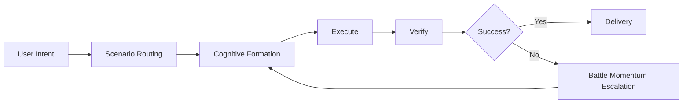
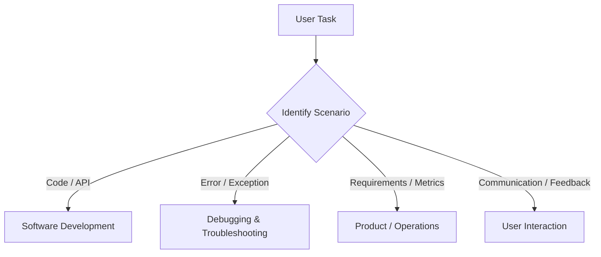
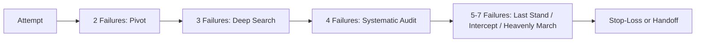
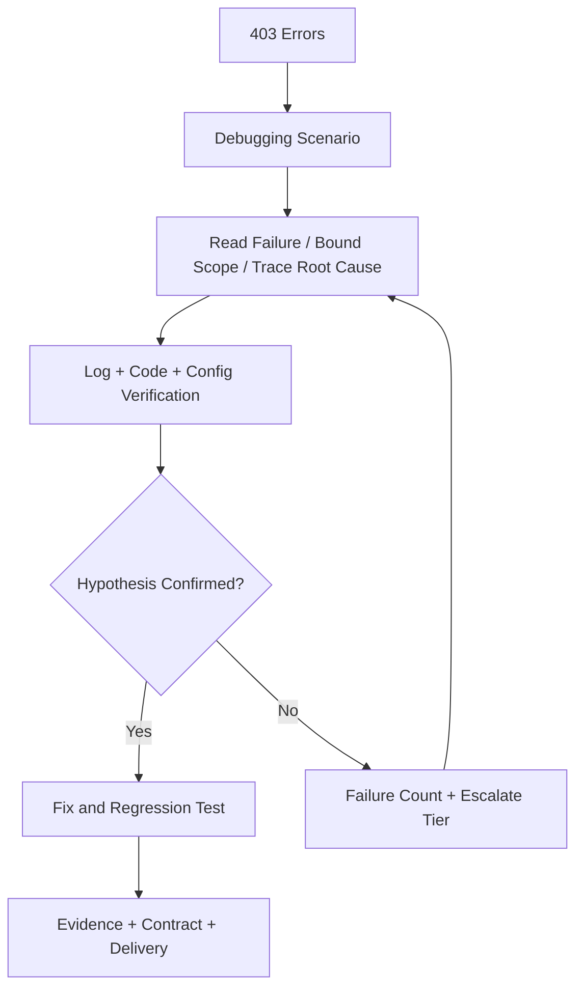

# 智行合一 (Unity of Knowing and Doing): The Design Philosophy of an AI Cognitive Engine

> 📖 中文版 / Chinese version: [WHY_PI_WORKS.md](WHY_PI_WORKS.md)

> **Why PI Works: The Design Philosophy of an AI Cognitive Engine**

> 📚 Want to understand the cognitive science principles behind the design? Read [PI Design Philosophy](DESIGN_PHILOSOPHY.en.md)

PI is not "a better prompt." It is an AI engine that weaves **cognition**, **action**, and **verification** into a closed loop. It is not concerned with "saying more" — it is concerned with **delivering reliably**.

---

## 1. Introduction: Why Existing AI Prompts Fall Short

Most AI systems still revolve around a system prompt, but this approach has three fundamental flaws:

1. **Static**: Whether writing code, designing a product, or diagnosing a failure, the AI uses the same thinking mode for everything.
2. **Stateless**: When something fails, the AI has no mechanism to change course — it simply "tries again."
3. **Opaque**: Users see conclusions but not the reasoning path. By the time they realize the direction is wrong, significant time has already been wasted.

PI addresses exactly this problem: it transforms AI from an "answer machine" into a **stateful cognitive engine**. The system doesn't just answer — it identifies the scenario, switches modes, and escalates strategy after failures.

---

## 2. Core Philosophy: 智行合一 (Unity of Knowing and Doing)

PI's name derives from Wang Yangming's principle of **知行合一 (zhī xíng hé yī)** — the Unity of Knowing and Doing. In the age of AI, this translates to:

> **True understanding must materialize as executable action; true action must in turn refine understanding.**

PI's core is therefore not about "thinking beautifully," but about unifying thinking, doing, and verifying. It structures the AI workflow as a closed loop:

This is the fundamental difference between PI and an ordinary prompt: an ordinary prompt constrains *what to say*; PI constrains **how to think, how to act, and how to course-correct**.

### Self-Evolution: The Four Laws and the Memory Mechanism

PI's closed loop is not a static cycle — it is a **rising spiral**. Every execution crystallizes into system experience through the "Four Laws of Evolution":

| Law | Trigger | System Behavior |
|-----|---------|-----------------|
| **Capture what works** | An effective strategy is discovered | Record the success pattern; auto-activate it in similar scenarios |
| **Immunize against failure** | A failure pattern is detected | Strengthen checklists so the same class of error never recurs |
| **Update on correction** | The user corrects a misconception | Update cognitive boundaries; align preferences immediately |
| **Align on feedback** | Post-delivery user feedback | Capture preferences and standards; continuously calibrate |

Combined with the Memory mechanism (Tried-Strategy Ledger + Post-Action Triple Reflection), the Four Laws transform PI from a "one-shot tool" into a **growing cognitive partner** — accumulating experience with every interaction, expanding boundaries with every failure. This is the fundamental distinction between PI and a static prompt: **it is not merely executing — it is evolving.**

---

## 3. Three Pillars of the Design Philosophy

### 1. Eastern Wisdom

PI does not use classical thought as rhetoric — it translates it into engineering mechanisms.

- **兵法 (The Art of War)**: Provides the concepts of *shì* (strategic momentum) and *biàn* (adaptive change). When a plan fails, switch the approach instead of brute-forcing; for complex problems, deliberate first, then act.
- **心学 (School of Mind)**: Provides 知行合一 (Unity of Knowing and Doing). Knowledge without verification is not true knowledge; action without reflection is not true action.
- **法家 (Legalism)**: Provides 法不阿贵 — the law plays no favorites. PI uses the "Ten Commandments of Anti-Patterns" to constrain the AI: guessing without searching, changing without verifying, repeating without switching, retreating without exhausting — all are prohibited.

Together, these form PI's Eastern core: **proactive, adaptive, boundary-respecting**.

### 2. Western Methodologies

PI simultaneously draws from cognitive science and systems thinking.

- **MBTI → Cognitive Function Mapping**: PI doesn't use MBTI as personality role-play — it uses it as an information-processing priority scheme. For example, Ni handles problem convergence, Ne handles divergent exploration, Te handles engineering execution, and Ti handles logical consistency.
- **Systems Thinking**: PI emphasizes closed loops, flywheels, and recovery protocols, turning one answer into the input for the next decision.
- **Test-Driven Spirit (TDD)**: Define the completion criteria first, then execute; verify results first, then declare done. Not "I think it's right," but "I have verified it."

Summary table:

| Function | Key Idea | AI Behavioral Translation |
|----------|----------|---------------------------|
| Ni | Convergent Intuition | Zero in on the core problem |
| Ne | Divergent Intuition | Find alternative paths |
| Te | Engineering Thinking | Invoke tools, drive execution |
| Ti | Consistency Thinking | Build the evidence chain |
| Fe/Fi | Empathy / Values Feeling | Align with user and boundaries |
| Se/Si | Perception / Retrieval Sensing | Read context and history |

### 3. Engineering Practice

PI's real-world implementation rests on engineering discipline.

- **Ten Commandments of Anti-Patterns**: By first defining "what errors are forbidden," you give the AI an immune system.
- **Verification Matrix / Quality Gates**: The Six Delivery Commands (✅Verify, 🔎Audit, 🔲Boundary, 🧭Calibrate, 📏Validate, ⭐Perfect) collectively determine "is it really done?"
- **Incremental Delivery (步步为营)**: Complex tasks are decomposed and verified step by step. Intermediate results are inspectable; risk is never deferred to the end.

PI's design is not mystical — it simply follows one straightforward engineering principle to its logical conclusion: **completion without evidence is not completion.**

---

## 4. Why PI Works

### 1. Scenario Routing: Different Tasks, Different "Brain Modes"

Ordinary prompts try to handle every task with the same cognitive circuit. PI acknowledges reality: programming, debugging, product analysis, and user communication are fundamentally different cognitive tasks.

### 2. Battle Momentum Escalation: Grow Stronger with Each Setback — but Know When to Stop

PI institutionalizes failure: after 2 failures it pivots strategy, after 3 it deep-searches, after 4 it launches a systematic audit, and beyond that it enters "Last Stand," "Intercepting the Dao," and "Heavenly March" phases. Unlike many AI systems that micro-tune the same path until they stall, PI **forces a strategy switch**.

### 3. Human–AI Resonance: Visible Reasoning

PI's "Five Transparencies" — **Visible Chain, Visible Evidence, Visible Tree, Visible Heart, Visible Contract** — surface the AI's reasoning, evidence, problem tree, confidence level, and delivery boundaries. The user doesn't find out what the AI did only after the fact — they can course-correct in real time.

### 4. Spirit Animal Totems: Turning Abstract States into a Perceivable Interface

Eagle, Shark, Lion, Fox, Dragon — five of the twelve spirit animals are shown here as representative examples (see SKILL_META.md §6.1 for the full totem). They compress abstract cognitive states into intuitive symbols. Each spirit animal corresponds to a distinct thinking mode:

| Spirit Animal | Cognitive State | Thinking Mode | Engineering Analogy |
|---------------|----------------|---------------|---------------------|
| 🦅 **Eagle** | Surveying the landscape | Panoramic overview / dimensional reduction — see the full picture from above, rapidly pinpoint the key issue | Architecture review: see the forest before the trees |
| 🦈 **Shark** | Deep-dive search | Exhaustive search / information gain — once locked on, follow every lead | Root cause analysis: follow the scent to the source |
| 🦁 **Lion** | Never retreat | Break out of local optima / power through — decisively switch attack vectors in adversity | Tenacity mode: change the road, not the destination |
| 🦊 **Fox** | Cautious flanking | Multi-dimensional probing / risk avoidance — avoid frontal assault, find the clever detour | Canary release: small fast steps, incremental verification |
| 🐲 **Dragon** | Limit-breaking | Cross-domain fusion / paradigm leap — shatter existing frameworks, reframe the problem from a higher dimension | Refactoring: tear it down and rebuild with a clearer direction |

This way, both humans and AI can align on state faster — when you see the 🦈 icon, you know the AI is in "tracking mode," not "cruising mode."

### 5. Ten Commandments of Anti-Patterns: Prevent Blunders Before Pursuing Brilliance

Many AI failures stem not from insufficient capability, but from poor process: guessing without searching, delivering without verifying, repeating failed approaches, giving up prematurely. PI blocks these low-level errors first, which is why its advantage is **greater long-term stability**.

Below are two concrete "anti-pattern vs. correct mode" comparisons:

> **Scenario 1: User reports "Login endpoint returning 500"**
>
> ❌ **Anti-pattern (Guessing without searching)**:
> "This is probably a database connection timeout. I suggest checking the database configuration."
> — No logs consulted, no code read, no evidence whatsoever — pure speculation.
>
> ✅ **PI's correct approach**:
> `Read failure → Bound scope → Trace root cause`: First check application logs for the error stack trace, then inspect middleware configuration to confirm the request chain, finally use `curl` for a minimal reproduction. The conclusion is delivered with evidence and verification commands.

> **Scenario 2: Fixing a CSS styling issue — first attempt didn't work**
>
> ❌ **Anti-pattern (Repeating without switching)**:
> "I changed the z-index from 100 to 999 — try again."
> — This is just a parameter tweak of the same strategy, with no analysis of why the first attempt failed.
>
> ✅ **PI's correct approach**:
> After the first failure, **pivot strategy**: investigate whether this is a stacking context issue rather than a z-index value issue. Use DevTools to verify the element stacking relationships and find the actual blocking element.

---

## 5. PI vs. Other Approaches

| Dimension | Conventional System Prompt | PI — Unity of Knowing and Doing |
|-----------|---------------------------|--------------------------------|
| Essence | Static template | Stateful cognitive engine |
| Task handling | One-size-fits-all logic | Scenario routing + cognitive formation switching |
| Failure handling | No escalation mechanism | Six-tier Battle Momentum + stop-loss |
| Process transparency | Conclusion-oriented | Five Transparencies — fully visible throughout |
| Definition of "done" | Verbal declaration | Verified output + quality gates |

If **Chain of Thought** mainly addresses "how to reason better," PI tackles the next layer: **when to switch reasoning modes, how to pivot after failure, how to verify results, and how to let humans take over the process**.

PI's uniqueness therefore lies in this:

> It is not a prompt template — it is a cognitive state machine that continuously adapts to the task, the failure count, the context, and user feedback.

---

## 6. Practical Example: A Typical Debugging Scenario

Suppose a user says: "The login API is suddenly returning a flood of 403s — help me investigate."

PI approaches this like a disciplined engineer:

1. **Scenario routing**: Classified as "Debugging & Troubleshooting," activating the "Precision Verification Formation."
2. **Visible Chain**: Read failure → Bound scope → Trace root cause → Test hypothesis.
3. **Tools first**: Check logs, inspect middleware, read configuration, perform a minimal reproduction.
4. **Failure counter**: If a hypothesis is disproven, automatically escalate to the next Battle Momentum tier instead of micro-adjusting in place.
5. **Evidence-backed delivery**: Present the conclusion, evidence, ruled-out possibilities, and verification commands.

PI's most important contribution here is turning "debugging" into **stateful search**.

---

## 7. Looking Ahead: PI as an AI Cognitive Operating System

PI may represent an emerging trend: the next phase of AI competition is not just about model size — it is about **cognitive architecture**.

Promising directions ahead include:

- **From Prompt to Protocol**: Moving beyond writing a single prompt to designing an entire protocol.
- **From Monolithic Intelligence to Team Intelligence**: Leader / Teammate / Coach multi-agent collaboration that increasingly resembles real organizations.
- **From Tool Augmentation to Human–AI Resonance**: AI no longer just does things for you — it forms a stable, transparent, correctable partnership with you.

---

## Conclusion

Why does PI work? Because it re-organizes scattered truths into a coherent system: Eastern wisdom provides *shì* (momentum), *biàn* (adaptability), and boundaries; Western methodologies provide cognitive structures and closed-loop verification; engineering practice provides quality gates and anti-pattern constraints.

Ultimately, PI answers a deeply practical question:

**How do you make AI not just articulate, but genuinely capable; not just capable, but visible, verifiable, and continuously evolving?**

That is what 智行合一 (Unity of Knowing and Doing) means in the age of AI.
