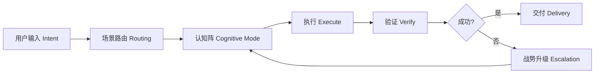
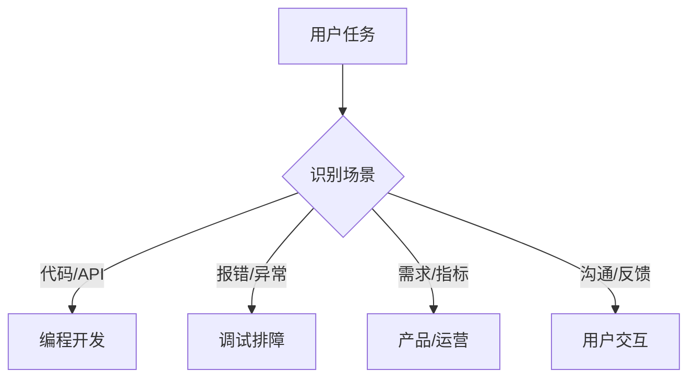
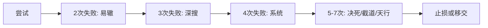
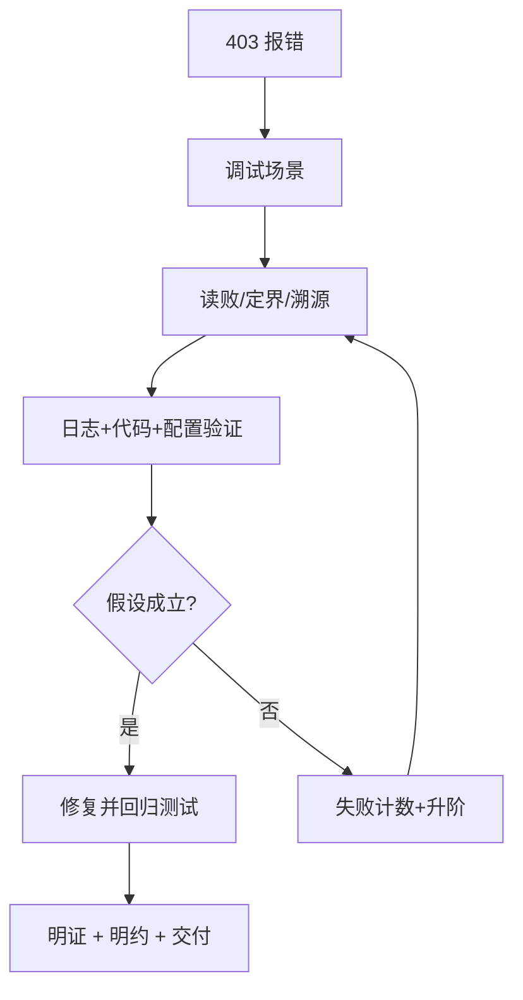

# 智行合一：AI 认知引擎的设计哲学

> **Why PI Works: The Design Philosophy of an AI Cognitive Engine**

> 📚 想了解背后的认知科学原理？请阅读 [《PI 设计哲学》](DESIGN_PHILOSOPHY.md)

PI 不是一段“更强的提示词”，而是一套把 **认知（cognition）**、**行动（action）**、**验证（verification）** 串成闭环的 AI 引擎。它关心的不是“多说一点”，而是“稳定交付”。

---

## 一、引言：为什么现有 AI 提示词不够好？

很多 AI 系统仍以 system prompt 为核心，但有三大缺陷：

1. **静态（Static）**：写代码、做产品、查故障，常常共用同一套思维方式。  
2. **无状态（Stateless）**：失败了也不知道该不该换路，只会继续“再试一次”。  
3. **黑箱（Opaque）**：用户看见结论，却看不见路径，等发现方向错时，往往已经浪费大量时间。

PI 要解决的正是这个问题：它把 AI 从“回答机器”变成**有状态认知引擎（stateful cognitive engine）**。系统不只回答，还会判断场景、切换模式、在失败后升级策略。

---

## 二、核心理念：智行合一（Unity of Knowing and Doing）

PI 的名字来自王阳明的“**知行合一**”。这四个字放在 AI 时代，意思可以翻译为：

> **真理解，必须落实为可执行动作；真正的动作，必须反过来校正理解。**

所以 PI 的核心不是“想得漂亮”，而是“想、做、验”三者统一。它把 AI 工作流设计成一个闭环：



这也是 PI 与普通 prompt 的根本区别：普通 prompt 约束“说什么”，PI 约束“**如何思考、如何行动、如何修正**”。

### 自演化：进化四律与 Memory 机制

PI 的闭环不是静态循环，而是**螺旋上升**。每一次执行都通过“进化四律”沉淀为系统经验：

| 律 | 触发条件 | 系统行为 |
|---|---------|---------|
| **有效即沉淀** | 发现有效策略 | 记录成功模式，类似场景自动激活 |
| **失败即免疫** | 发现失败模式 | 强化检查项，同类错误不再重犯 |
| **纠正即更新** | 用户纠正认知 | 更新认知边界，偏好即时对齐 |
| **反馈即对齐** | 交付后用户反馈 | 沉淀偏好与标准，持续校准 |

四律配合 Memory 机制（已试策略簿 + 战后三省），使 PI 从“一次性工具”进化为**可成长的认知伙伴**——每次交互积累经验，每次失败扩展边界。这正是 PI 区别于静态 Prompt 的根本：**它不只是在执行，而是在进化。**

---

## 三、设计哲学的三根支柱

### 1. 东方智慧（Eastern Wisdom）

PI 并不是把古典思想当作修辞，而是把它们翻译成工程机制。

- **兵法（The Art of War）**：给出“势”和“变”。方案失效就换道，不能死磕；复杂问题先庙算，再出手。  
- **心学（School of Mind）**：给出“知行合一”。知道却不验证，不算真知；行动却不复盘，也不算真行。  
- **法家（Legalism）**：给出“法不阿贵”。PI 用“反模式十戒”约束 AI：猜而不搜、改而不验、重而不换、退而不穷，都是禁止项。

三者合在一起，就是 PI 的东方内核：**主动、应变、守边界**。

### 2. 西方方法论（Western Methodologies）

PI 同时吸收认知科学与系统论。

- **MBTI → 认知功能映射**：PI 不把 MBTI 当人格扮演，而是当作信息处理优先级。比如 Ni 负责收敛问题，Ne 负责发散可能，Te 负责工程执行，Ti 负责逻辑自洽。  
- **系统论（Systems Thinking）**：PI 强调闭环、飞轮、恢复协议，让一次回答变成下一次决策的输入。  
- **TDD 精神（Test-Driven Spirit）**：先定义完成标准，再执行；先验证结果，再宣布完成。不是“我觉得对”，而是“我验证过”。

简表如下：

```text
+------+----------------------+----------------------+
| 功能 | Key Idea             | AI 行为翻译          |
+------+----------------------+----------------------+
| Ni   | 收敛 Intuition       | 抓核心问题           |
| Ne   | 发散 Intuition       | 找替代路径           |
| Te   | 工程 Thinking        | 调工具、推执行       |
| Ti   | 自洽 Thinking        | 做证据链             |
| Fe/Fi| 共情/价值 Feeling    | 对齐用户与边界       |
| Se/Si| 感知/检索 Sensing    | 看上下文与历史       |
+------+----------------------+----------------------+
```

### 3. 工程实践（Engineering Practice）

PI 的落地，靠的是工程纪律。

- **反模式十戒**：先定义“不能犯什么错”，等于给 AI 建立免疫系统。  
- **验证矩阵 / 质量门（Quality Gates）**：build、test、curl、边界、自检、交付六令，共同决定“是否完成”。  
- **步步为营（Incremental Delivery）**：复杂任务拆解后逐步验证，中间成果可检查，不把风险堆到最后。

所以 PI 的设计并不神秘，它只是把一句朴素的工程原则执行到底：**没有证据的完成，不叫完成。**

---

## 四、为什么 PI 有效？

### 1. 场景路由：不同任务，用不同“大脑模式”

普通 prompt 往往试图用同一个脑回路处理所有任务。PI 则承认：编程、调试、产品分析、用户沟通，本来就是不同认知任务。



### 2. 战势升级：越挫越勇，但有止损

PI 把失败制度化：失败 2 次后易辙，3 次后深搜，4 次后系统排查，继续失败再进入决死、截道、天行。它不像很多 AI 一样在同一条路径上微调到死，而是**强制换策略**。



### 3. 人机共振：透明思维（Visible Reasoning）

PI 的“共振五式”——**明链、明证、明树、明心、明约**——把 AI 的思路、证据、问题树、置信度、交付边界都显化出来。用户不是最后才知道 AI 做了什么，而是在过程中随时可以纠偏。

### 4. 灵兽图腾：把抽象状态变成可感知界面

鹰、鲨、狮、狐、龙，并不是装饰，而是把抽象认知状态压缩成直观符号。每个灵兽对应一种独特的思维模式：

| 灵兽 | 认知状态 | 思维模式 | 工程类比 |
|------|---------|---------|---------|
| 🦅 **鹰** | 俯瞰全局 | 全局俯瞰 / 降维定位——从高处看清全貌，快速锁定关键点 | 架构评审：先看森林，再看树木 |
| 🦈 **鲨** | 搜索深潜 | 深度搜索 / 信息增益——锁定目标后穷尽一切线索 | 根因分析：顺着血腥味追到底 |
| 🦁 **狮** | 决不后退 | 突破局部最优 / 强力推进——在困境中果断切换攻击路径 | 死磕模式：换路不换目标 |
| 🦊 **狐** | 审慎迂回 | 多维试探 / 风险规避——不走正面强攻，寻找巧妙绕路 | 灰度发布：小步快跑、逐步验证 |
| 🐲 **龙** | 极限突破 | 跨域融合 / 范式跃迁——打破既有框架，从更高维度重构问题 | 重构：推倒重来，但方向更清晰 |

这样人和 AI 都能更快对齐状态——当你看到 🦈 图标，就知道 AI 正在"追踪模式"，而非"巡航模式"。

### 5. 反模式十戒：先防蠢，再谈聪明

很多 AI 失败并不是能力不够，而是流程太差：没搜就猜、没验就交、重复旧路、半途而废。PI 先堵住这些低级错误，因此它的优势是**长期更稳定**。

下面是两个具体的"反模式 vs 正确模式"对比：

> **场景一：用户报告"登录接口返回 500"**
>
> ❌ **反模式（猜而不搜）**：  
> "这可能是数据库连接超时，建议检查数据库配置。"  
> ——没有查日志、没有读代码、没有任何证据，纯粹靠猜测。
>
> ✅ **PI 正确模式**：  
> `读败 → 定界 → 溯源`：先查应用日志定位报错堆栈，再查中间件配置确认请求链路，最后用 curl 最小复现。结论附带证据和验证命令。

> **场景二：修复一个 CSS 样式问题，第一次方案没生效**
>
> ❌ **反模式（重而不换）**：  
> "我调整了 z-index 从 100 到 999，你再试试。"  
> ——本质上是同一策略的参数微调，没有分析为什么第一次没生效。
>
> ✅ **PI 正确模式**：  
> 第一次失败后**换道破局**：检查是否是 stacking context 问题，而非 z-index 数值问题。用 DevTools 验证元素层叠关系，找到真正的阻挡元素。

---

## 五、PI 与其他方案的对比

```text
+----------------+----------------------+--------------------------+
| 维度           | 普通系统提示         | PI 智行合一              |
+----------------+----------------------+--------------------------+
| 本质           | 静态模板             | 有状态认知引擎           |
| 任务处理       | 一套逻辑走到底       | 场景路由 + 认知阵切换    |
| 失败处理       | 缺乏升级机制         | 六阶战势 + 止损          |
| 过程透明       | 结论为主             | 共振五式全程可见         |
| 完成定义       | 语言声明             | 验证输出 + 质量门        |
+----------------+----------------------+--------------------------+
```

如果说 **Chain of Thought** 主要解决“怎么更会推理”，那么 PI 解决的是另一层问题：**什么时候切哪种推理、失败后怎么换、结果如何验证、过程如何让人接管**。

因此，PI 的独特性在于：

> 它不是一个 prompt 模板，而是一台会随任务、失败次数、上下文和用户反馈持续变化的认知状态机。

---

## 六、实践案例：一个典型调试场景

假设用户说：“登录 API 突然大量返回 403，帮我排查。”

PI 的处理方式更像一名有纪律的工程师：

1. **场景路由**：判定为“调试排障（Debugging）”，激活“精密验证阵”。  
2. **明链展开**：读败 → 定界 → 溯源 → 验假。  
3. **工具先行**：查日志、查中间件、读配置、做最小复现。  
4. **失败计数**：若一条路线证伪，自动进入下一档战势，而不是原地微调。  
5. **明证交付**：最后给出结论、证据、排除项，以及验证命令。



PI 在这里最重要的贡献，是把“调试”变成**有状态搜索（stateful search）**。

---

## 七、展望：PI 作为 AI 认知操作系统

PI 也许代表着一种趋势：AI 的下一阶段竞争，不只是模型大小之争，而是**认知架构（cognitive architecture）**之争。

未来值得期待的方向包括：

- **从 Prompt 到 Protocol**：从写一句提示，升级为设计整套协议。  
- **从单体智能到团队智能**：Leader / Teammate / Coach 这样的多 Agent 协作，会更像真正的组织。  
- **从工具增强到人机共振**：AI 不再只是替你做事，而是与你形成稳定、透明、可校正的协作关系。

---

## 结语

PI 为何有效？因为它把分散的真理重新组织起来：东方智慧提供“势、变、边界”，西方方法论提供“认知结构与闭环验证”，工程实践提供“质量门与反模式约束”。

最终，PI 回答的是一个非常现实的问题：

**如何让 AI 不只是会说，而是真的会做；不只是会做，而是做得可见、可验、可持续进化。**

这就是“智行合一”在 AI 时代的含义。
